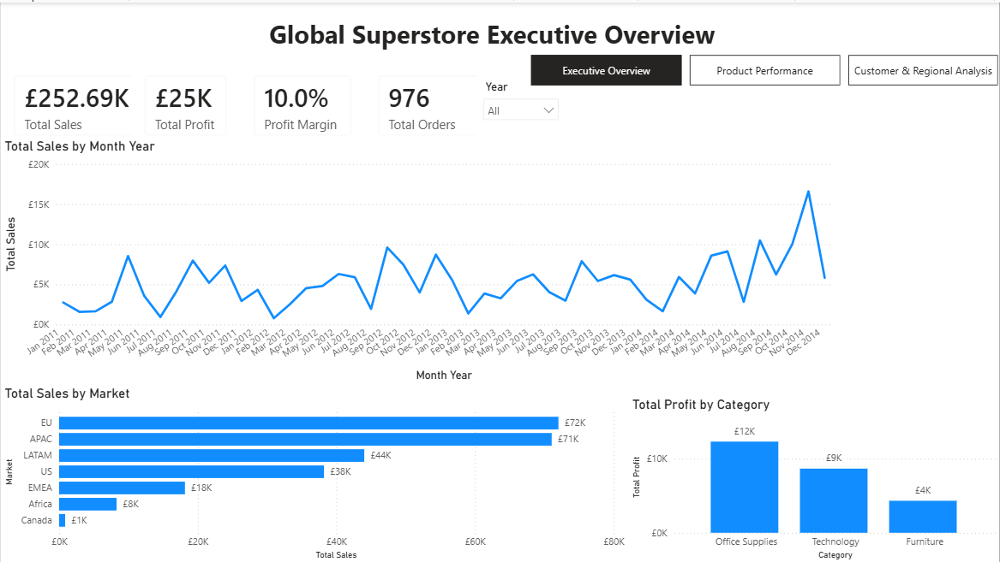
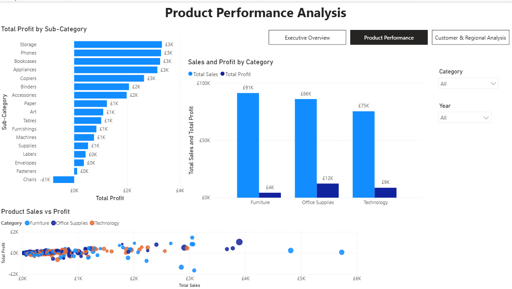
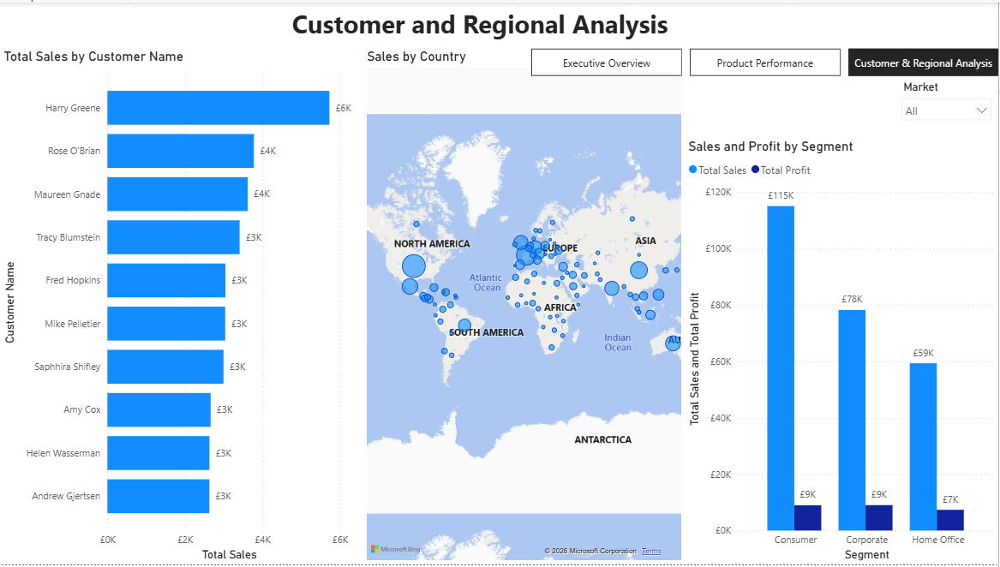

# Global Superstore Power BI Dashboard

A three-page interactive Power BI report analysing global sales, profitability, product performance, customer value, and regional trends between 2011 and 2014.

[Download the Power BI report](./Global_Superstore_PowerBI_Dashboard.pbix)

## Report Previews

### Executive Overview



### Product Performance



### Customer and Regional Analysis



## Project Overview

This project transforms a transactional Global Superstore dataset into an interactive business intelligence report.

The report was designed to answer five main questions:

1. How did sales change between 2011 and 2014?
2. Which markets generated the highest sales?
3. Which categories and sub-categories were most profitable?
4. Which products generated high sales but weak or negative profit?
5. Which customers, market segments, and countries contributed most to performance?

The final report contains three connected pages:

1. **Executive Overview**
2. **Product Performance**
3. **Customer and Regional Analysis**

## Dataset

The source Excel workbook contains:

- **1,000 transaction rows**
- **24 fields**
- Orders from **2011 to 2014**
- **93 countries**
- **Seven markets**
- **Three product categories**
- **17 product sub-categories**
- **674 customers**
- **934 products**

### Source Fields

The dataset includes:

- Row ID
- Order ID
- Order Date
- Ship Date
- Ship Mode
- Customer ID
- Customer Name
- Segment
- City
- State
- Country
- Postal Code
- Market
- Region
- Product ID
- Category
- Sub-Category
- Product Name
- Sales
- Cost Price
- Quantity
- Discount
- Shipping Cost
- Order Priority

## Power Query Preparation

The dataset was cleaned and transformed in Power Query before loading it into the Power BI model.

### Data-Type Validation

The following data types were applied:

- Order Date and Ship Date as Date
- Row ID and Quantity as Whole Number
- Sales, Cost Price, Discount, and Shipping Cost as Decimal Number
- Postal Code as Text
- Identifier and category fields as Text

Postal Code was stored as text because it is an identifier rather than a numerical measure.

### Column Profiling

Column profiling was changed from the default sample to the **entire dataset**.

This allowed data quality, errors, and empty values to be assessed across all 1,000 rows.

### Geography Key

A custom key was created in both the fact table and geography dimension:

```powerquery
Text.Combine({
    if [Country] = null then "" else [Country],
    if [State] = null then "" else [State],
    if [City] = null then "" else [City],
    if [Postal Code] = null then "" else [Postal Code],
    if [Region] = null then "" else [Region],
    if [Market] = null then "" else [Market]
}, "|")
```

This provides a consistent relationship between transaction records and geographic locations.

## Data Model

A star-schema model was created to separate transactional measures from descriptive dimensions.

### Fact Table

`Fact Sales`

Contains the transaction-level sales records and numerical measures.

### Dimension Tables

- `Dim Product`
- `Dim Customer`
- `Dim Geography`
- `Dim Date`

### Measures Table

`_Measures`

A dedicated table was created to store all DAX measures in one organised location.

### Relationships

The model uses active one-to-many relationships with single-direction filtering:

```text
Dim Product[Product ID]
        1
        |
        *
Fact Sales[Product ID]
```

```text
Dim Customer[Customer ID]
        1
        |
        *
Fact Sales[Customer ID]
```

```text
Dim Geography[Geography Key]
        1
        |
        *
Fact Sales[Geography Key]
```

```text
Dim Date[Date]
        1
        |
        *
Fact Sales[Order Date]
```

The Date table was marked as the official Power BI date table.

## Date Dimension

A dynamic date table was created in Power Query using the earliest and latest order dates.

```powerquery
let
    StartDate = Date.StartOfYear(List.Min(#"Fact Sales"[Order Date])),
    EndDate = Date.EndOfYear(List.Max(#"Fact Sales"[Order Date])),
    DateList = List.Dates(
        StartDate,
        Duration.Days(EndDate - StartDate) + 1,
        #duration(1, 0, 0, 0)
    ),
    DateTable = Table.FromList(
        DateList,
        Splitter.SplitByNothing(),
        {"Date"}
    ),
    ChangedType = Table.TransformColumnTypes(
        DateTable,
        {{"Date", type date}}
    )
in
    ChangedType
```

Additional date fields were created:

- Year
- Quarter
- Month
- Month Number
- Month Year
- Year Month Number

`Month Year` was sorted using `Year Month Number` so monthly charts appear chronologically.

## DAX Measures

### Total Sales

```DAX
Total Sales =
SUM('Fact Sales'[Sales])
```

### Total Cost

```DAX
Total Cost =
SUM('Fact Sales'[Cost Price])
```

### Total Profit

```DAX
Total Profit =
[Total Sales] - [Total Cost]
```

### Profit Margin

```DAX
Profit Margin =
DIVIDE(
    [Total Profit],
    [Total Sales],
    0
)
```

### Total Orders

```DAX
Total Orders =
DISTINCTCOUNT('Fact Sales'[Order ID])
```

### Average Order Value

```DAX
Average Order Value =
DIVIDE(
    [Total Sales],
    [Total Orders],
    0
)
```

### Total Quantity

```DAX
Total Quantity =
SUM('Fact Sales'[Quantity])
```

### Total Shipping Cost

```DAX
Total Shipping Cost =
SUM('Fact Sales'[Shipping Cost])
```

### Previous-Year Sales

```DAX
Sales Previous Year =
CALCULATE(
    [Total Sales],
    DATEADD('Dim Date'[Date], -1, YEAR)
)
```

### Year-over-Year Sales Growth

```DAX
Sales YoY Growth =
DIVIDE(
    [Total Sales] - [Sales Previous Year],
    [Sales Previous Year],
    0
)
```

## Page 1: Executive Overview

The Executive Overview provides a high-level summary of business performance.

### KPI Cards

The page contains cards for:

- Total Sales
- Total Profit
- Profit Margin
- Total Orders

In the completed dashboard view, the cards display approximately:

| KPI | Value |
|---|---:|
| Total Sales | £123,854 |
| Total Profit | £16,512 |
| Profit Margin | 13.3% |
| Total Orders | 483 |

### Monthly Sales Trend

A line chart displays monthly sales between January 2011 and December 2014.

The complete timeline is visible without scrolling, allowing seasonal variation and monthly fluctuations to be compared.

### Sales by Market

A ranked horizontal bar chart compares total sales across seven markets.

| Market | Approximate sales |
|---|---:|
| APAC | £35.5K |
| EU | £33.5K |
| LATAM | £22.8K |
| US | £18.6K |
| EMEA | £8.9K |
| Africa | £4.4K |
| Canada | £0.1K |

APAC and EU were the strongest markets in the displayed analysis.

### Profit by Category

Office Supplies generated the highest total profit.

| Category | Approximate profit |
|---|---:|
| Office Supplies | £9.8K |
| Furniture | £3.9K |
| Technology | £2.8K |

### Interactivity

A Year dropdown filters all visuals on the page.

## Page 2: Product Performance

The Product Performance page investigates category, sub-category, and individual product results.

### Profit by Sub-Category

Sub-categories are ranked from highest to lowest profit.

The strongest performers included:

- Copiers
- Storage
- Paper
- Art
- Phones
- Accessories

Binders recorded a substantial loss of approximately **£11.2K**, making it a clear area for investigation.

### Sales and Profit by Category

A clustered column chart compares sales and profit across:

- Office Supplies
- Furniture
- Technology

Displaying sales and profit together prevents high-revenue categories from automatically being interpreted as the most profitable.

### Product Sales vs Profit

A scatter plot displays:

- Total Sales on the horizontal axis
- Total Profit on the vertical axis
- Product Name as the detail
- Category as the legend
- Total Quantity as bubble size

The plot highlights four types of products:

1. High sales and high profit
2. High sales but low profit
3. Low sales but strong profit
4. Loss-making products

This demonstrates that sales volume alone is not sufficient for evaluating product performance.

### Slicers

The page contains dropdown slicers for:

- Category
- Year

## Page 3: Customer and Regional Analysis

The third page focuses on customers, geographical performance, and customer segments.

### Top 10 Customers

A Top N visual filter displays the ten customers with the highest total sales.

Leading customers include:

- Tamara Dahlen
- Hunter Lopez
- Raymond Messe
- Thea Faber
- Nathan Cano

### Sales by Country

A proportional-symbol map displays total sales by country.

Bubble size represents sales, while tooltips provide:

- Total Profit
- Profit Margin

The map allows users to identify geographical concentrations of sales and compare performance between countries.

### Sales and Profit by Segment

The segment chart compares sales and profit for:

- Consumer
- Corporate
- Home Office

Approximate displayed results are:

| Segment | Sales | Profit |
|---|---:|---:|
| Consumer | £66K | £8.1K |
| Corporate | £32K | £2.9K |
| Home Office | £26K | £5.6K |

Consumer generated the highest sales and profit.

Home Office produced lower sales than Corporate but a higher displayed profit, indicating stronger profitability relative to revenue.

### Market Slicer

A Market dropdown filters the customer chart, country map, and segment chart together.

## Key Findings

### APAC and EU Led Sales

APAC and EU generated the highest sales among the seven markets.

Together they represented a substantial proportion of the sales displayed in the Executive Overview.

### Office Supplies Was the Most Profitable Category

Office Supplies generated significantly more profit than Furniture or Technology.

Its performance was supported by profitable sub-categories including Storage, Paper, Art, Supplies, and Appliances.

### Binders Required Investigation

Binders recorded the largest sub-category loss.

Possible areas for further investigation include:

- Discount levels
- Cost pricing
- Shipping costs
- Regional differences
- Product-level performance
- Customer profitability

The dashboard identifies the issue but does not establish its underlying cause.

### Sales Did Not Always Translate Into Profit

The product scatter plot contains products with meaningful sales but weak or negative profit.

This indicates that decisions based only on revenue could overlook problems involving cost, discounting, or fulfilment.

### Consumer Was the Largest Segment

Consumer generated the highest sales and profit.

Home Office showed stronger displayed profit than Corporate despite lower total sales, suggesting that revenue and profitability rankings can differ.

### Monthly Performance Was Volatile

The monthly sales line chart shows considerable variation throughout the four-year period.

This supports further analysis of seasonality, order timing, promotions, and market-specific demand.

## Interactive Features

The report includes:

- Year slicer
- Category slicer
- Market slicer
- Page navigator
- Interactive cross-filtering
- Top N customer filtering
- Proportional map bubbles
- Product-level scatter plotting
- Data labels
- Tooltips
- Chronologically sorted month labels
- Responsive KPI cards

## Page Navigation

A Page Navigator connects all three pages:

- Executive Overview
- Product Performance
- Customer & Regional Analysis

The active page is highlighted automatically.

## Potential Business Applications

A similar Power BI solution could help organisations:

- Monitor sales and profitability
- Identify underperforming products
- Compare markets and countries
- Evaluate customer segments
- Identify high-value customers
- Investigate loss-making sub-categories
- Track monthly performance
- Support pricing and discount decisions
- Prioritise regional investment
- Communicate performance to senior stakeholders

## Limitations

- The dataset covers 2011 to 2014 and is not current
- It is a demonstration dataset rather than audited financial data
- Full source methodology was not provided
- Profit is calculated as Sales minus the dataset-defined Cost Price
- The meaning and calculation method of Cost Price should be validated before operational use
- Currency conversion methodology was not supplied
- Sales from multiple countries are presented using one report currency
- The report does not include sales targets or budget data
- The analysis identifies patterns but does not prove their causes
- Country-level analysis can hide differences between states and cities
- Customer profitability would require additional customer-level cost information
- Product results may be influenced by discounting, shipping, and regional mix

## Skills Demonstrated

- Power BI Desktop
- Power Query
- Excel data connection
- Data-type validation
- Full-dataset column profiling
- Star-schema modelling
- Fact and dimension tables
- Relationship management
- Composite keys
- Date-table creation
- DAX measures
- Time-intelligence calculations
- KPI cards
- Line charts
- Bar and column charts
- Scatter plots
- Map visuals
- Top N filters
- Slicers
- Page navigation
- Conditional analysis
- Report formatting
- Business interpretation
- GitHub documentation

## Tools Used

- Microsoft Power BI Desktop
- Power Query
- DAX
- Microsoft Excel
- GitHub

## Repository Structure

```text
powerbi-global-superstore-dashboard/
│
├── Global_Superstore_PowerBI_Dashboard.pbix
├── README.md
│
└── screenshots/
    ├── global-superstore-executive-overview.png
    ├── global-superstore-product-performance.png
    └── global-superstore-customer-regional-analysis.png
```

## How to Explore the Project

### Local Version

1. Download `Global_Superstore_PowerBI_Dashboard.pbix`
2. Open the file in Power BI Desktop
3. Use the Page Navigator to move between report pages
4. Select values from the Year, Category, and Market slicers
5. Hover over charts and map bubbles for additional details
6. Click chart elements to cross-filter other visuals
7. Clear slicer selections to restore the complete view

## Project Outcome

This project demonstrates a complete Power BI workflow from source-data preparation to interactive business reporting.

It combines Power Query, star-schema modelling, DAX, time intelligence, geographic analysis, product profitability, customer segmentation, and multi-page navigation in a structured portfolio project.
